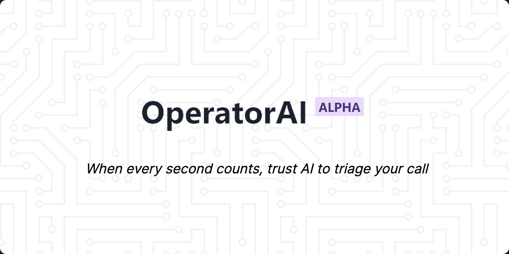

# 🏆 Winner

OperatorAI won third place in the [AssmeblyAI Winter Hackathon](https://hackathon.assemblyai.com/). Find our demo on [Devpost](https://devpost.com/software/draft-w86vkc).

# 🚨 OperatorAI

Did you know many 911 call centers are understaffed? During the last hurricane in Florida, thousands of 911 callers were faced with no services. Also, the latest report showed 60 percent of callers in the US cannot be located by emergency dispatchers because of outdated technologies.

OperatorAI is a revolutionary new AI system that helps triage 911 calls and connect callers with emergency services. With OperatorAI, you can trust that your call will be handled quickly and efficiently, even during times of high call volume or natural disasters. Thanks to its advanced technology, OperatorAI can also accurately locate callers, ensuring that help arrives as quickly as possible. So when you need help in an emergency, trust OperatorAI to help you get the assistance you need.

# 🤖 Technologies

Here is a diagram explaining how OperatorAI works! Our solution relies on several APIs and WebSocket connections to provide **real-time** solutions for any emergency.

## Back-End

### 🧠 AssemblyAI

We used AssemblyAI [Real-Time Transcription](https://www.assemblyai.com/docs/walkthroughs#realtime-streaming-transcription) for our project because it is a highly accurate and reliable transcription service that can quickly and accurately transcribe spoken words into text. This is important for our project because it allows us to quickly and accurately understand the content of incoming 911 calls, which is crucial for prioritizing calls based on their severity.

Additionally, the real-time aspect of the transcription service allows us to quickly and efficiently send transcripts to available operators, further improving the ability to provide timely emergency response. Overall, AssemblyAI Real-Time Transcription was the perfect fit for our project because it allows us to quickly and accurately process incoming 911 calls.

### ☎️ Twilio

Using Twilio's [Programmable Voice API](https://www.twilio.com/docs/voice), we were able to seamlessly accept and handle calls from callers. Twilio's powerful and intuitive REST API webhook and WebSockets made it easy for us to quickly respond to callers and provide them with the assistance they needed. This saved us from the time-consuming and complex process of building and maintaining our infrastructure.

Twilio's caller id feature was incredibly useful for 911 operators, allowing them to quickly and easily identify who they were speaking to and provide more personalized and effective assistance. Overall, Twilio's platform proved to be a valuable asset for our hackathon project, providing us with the tools and capabilities we needed to quickly and easily handle calls from callers.

### 🤗 HuggingFace

We utilized HuggingFace's [Inference API](https://huggingface.co/inference-api) to conduct a comprehensive analysis of the final transcriptions provided by AssemblyAI. This enabled us to gain a thorough understanding of the content of the calls and make informed decisions about their priorities. The combination of AssemblyAI's transcription capabilities and HuggingFace's Inference API allowed us to efficiently and effectively process incoming 911 calls and provide timely emergency response.

With HuggingFace, we use three Transformer models:
* Named Entity Recognition ([dbmdz/bert-large-cased-finetuned-conll03-english](https://huggingface.co/dbmdz/bert-large-cased-finetuned-conll03-english)). Used to determine the caller’s name and location (PER and LOC tokens)
  * As a fall-back model, we apply an additional NER with better accuracy but takes more time to run ([Jean-Baptiste/roberta-large-ner-english](https://huggingface.co/Jean-Baptiste/roberta-large-ner-english?text=My+name+is+wolfgang+and+I+got+into+a+car+accident+on+Interstate+280)). It is run with the HuggingFace wait_for_model parameter and once it returns, the values will be updated live on the site
* Zero Shot Text Classification ([facebook/bart-large-mnli](https://huggingface.co/facebook/bart-large-mnli?candidateLabels=Medical+emergency%2C+fire+emergency%2C+traffic+accident%2C+crime+in+progress%2C+other+emergency&multiClass=false&text=My+house+is+being+robbed.+Please+send+help)). Used to determine the nature of their emergency based on custom categories (medical emergency, fire emergency, traffic accident, crime in progress, other emergency)

### 🌊 DigitalOcean

We also utilized [DigitalOcean](https://www.digitalocean.com/) to host a Virtual Private Server that exposes our Twilio Webhook. This server is accessed via a [Cloudflare Zero Trust Tunnel](https://developers.cloudflare.com/cloudflare-one/connections/connect-apps/) and runs our backend codebase using Node.js. Additionally, it establishes a WebSocket connection between Twilio, the server, and AssemblyAI, allowing for seamless communication and real-time processing of incoming 911 calls. This setup allows us to efficiently and effectively manage the flow of information and provide timely emergency response.

### 🔥 Firebase Real-time Database

Firebase [Realtime Database](https://firebase.google.com/docs/database) was used in our project because of its real-time synchronization capabilities. This means that any changes made to the database are instantly reflected on all connected devices, which is essential for 911 operators to instantly see live transcriptions from the phone call. 

Firebase Realtime Database was easy to set up and use, which allowed us to quickly iterate on our project and get it up and running quickly. Its powerful JS SDK, used both in the frontend and backend, also made it easy for us to read and write data to the database and take advantage of its flexible data model to structure our data in a way that suited our needs. Overall, Firebase Realtime Database was a great choice for our project because of its real-time synchronization and ease of use.

## Front-End

### ⚡ Vite & React 

We used [Vite](https://vitejs.dev/) and React for our hackathon project because they both enable fast and efficient development of modern frontend applications. Together, Vite and React provided us with a powerful and flexible development environment that allowed us to quickly and easily create a user-friendly frontend for our app. 

Vite and React are both widely adopted and have a large and active community of developers, which made it easier for us to find support and resources as we worked on our project. Overall, Vite and React were great choices for our hackathon project because of their speed, efficiency, and flexibility.

### 🎨 Chakra-UI

After careful consideration, we ultimately decided to use [Chakra UI](https://chakra-ui.com/) for our hackathon project. We were drawn to this popular React component library because of its simplicity, modularity, and accessibility. Chakra UI is designed to be highly customizable and easy to use, and it follows the design paradigm of TailwindCSS, which is known for its simplicity and flexibility. 

Chakra UI comes with a set of fully typed and extendable components that allow for rapid development, which was crucial for a hackathon project with a tight timeline. Overall, we were impressed by the capabilities and features of Chakra UI, and we are happy that it helped us build a high-quality and accessible application for our hackathon project.

### 🧑‍💻 Git & GitHub

To ensure that our hackathon project was well-organized and collaborative, we made use of Git and [GitHub](https://github.com/dtemir?tab=repositories) best practices, as well as Visual Studio Code Live Share, throughout the development process. We used Git to manage our codebase and track changes, and we used GitHub to host our repository and facilitate collaboration.

To help us work together more efficiently, we used Visual Studio Code Live Share to enable real-time collaboration on our codebase, which allowed us to easily share our work and make changes together in real time. 

We made sure to use best practices like creating pull requests and using the conventional commit format when committing changes to our repository to ensure that our codebase remained clean and organized.

These tools and practices allowed us to easily collaborate and contribute to the project, and they helped us maintain a high level of code quality and organization throughout the development process.

# Scripts

If you would like to try out the final product, call *+1 (408) 617-9557* and follow any of the scripts above (or come up with your own!)

## Robbery

Hello, my name is John and I am calling to report an emergency. I am at 2nd street and I have just witnessed an armed robbery. The suspect is still on the scene and I am afraid they may try to harm me or others. Please send help immediately. This is a life-threatening situation and I need assistance right away. Thank you.

## Fire

Hello, my name is Bob. I am at 532 Geary Street and there is a fire in my apartment building. I am not sure if anyone else is in the building, but I am safely outside. Please send help immediately. This is a life-threatening situation and I need assistance right away. Thank you.

## Noise complaint

I am Liam. I am at 350 DNA Way, and there is a party going above my apartment for hours now. They are putting on very loud music which is very disturbing and I have to go back to work tomorrow morning.

## Gunshot

Hey, my name is Noah. I am at 600 Carmel Ave, and I heard a gunshot close to me, but I do not know the direction. I am safe in my house, but I think someone got hurt or might get hurt if you do not rush. Please come fast!

## Car Accident

Hey, I am Lucas, I am at home at 501 4th Ave and I was just getting out of my garage and someone just crashed into me. I am very concerned. I have my child with me. She looks fine but it is hard to check because my legs are stuck and I cannot move. I do not know if I am bleeding or not. Can you please come as soon as possible?
